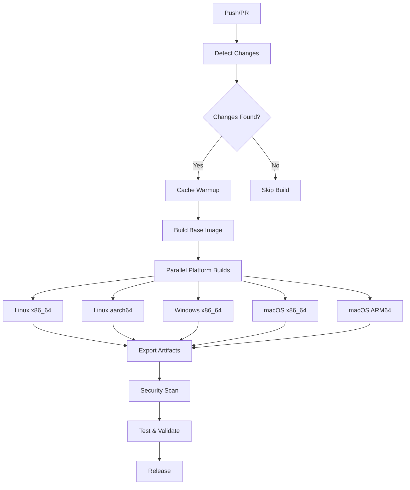

# NoMercy FFmpeg Builder

<div align="center">

[](https://github.com/NoMercy-Entertainment/nomercy-ffmpeg/actions)
[](https://github.com/NoMercy-Entertainment/nomercy-ffmpeg/actions)
[](https://opensource.org/licenses/MIT)

**Internal Build Tool for NoMercy MediaServer**

*High-performance, cross-platform FFmpeg binaries optimized for media processing*

</div>

## 🎯 Purpose

This repository contains the build infrastructure for creating optimized FFmpeg binaries specifically tailored for the **NoMercy MediaServer** ecosystem. These builds include custom configurations, codecs, and optimizations that enhance media processing capabilities within our platform.

> **⚠️ Internal Use Only**  
> These FFmpeg builds are specifically configured for NoMercy MediaServer and may not be suitable for general-purpose use. For standard FFmpeg binaries, please visit the [official FFmpeg website](https://ffmpeg.org/).

## 🏗️ Architecture

Our build system uses a modular Docker-based approach with automated CI/CD pipelines:

### Supported Platforms
- **Linux**: x86_64, aarch64 (ARM64)
- **Windows**: x86_64
- **macOS**: x86_64, Apple Silicon (ARM64)

### Build Features
- 🔒 **Security Scanning**: All binaries undergo vulnerability assessment
- 🧪 **Automated Testing**: Cross-platform validation and quality assurance
- 📦 **Artifact Management**: Versioned releases with platform-specific packages
- 🔄 **Smart Builds**: Intelligent change detection to optimize build times
- 🛡️ **Reproducible Builds**: Consistent, deterministic compilation process

## 🚀 CI/CD Pipeline

Our GitHub Actions workflows provide a complete automation pipeline:



### Workflow Components
- **Change Detection**: Only builds what's changed
- **Multi-Platform Builds**: Parallel compilation across all supported platforms
- **Security Scanning**: Trivy vulnerability assessment
- **Quality Assurance**: Automated testing and validation
- **Release Management**: Automated versioning and artifact distribution

## 🛠️ Development

### Prerequisites
- Docker with multi-platform support
- GitHub CLI (for release management)
- PowerShell or Bash (depending on platform)

### Local Development
```bash
# Clone the repository
git clone https://github.com/NoMercy-Entertainment/nomercy-ffmpeg.git
cd nomercy-ffmpeg

# Build for a specific platform
docker build -f ffmpeg-linux-x86_64.dockerfile -t ffmpeg-linux .

# Test the build
docker run --rm ffmpeg-linux ffmpeg -version
```

### Testing
```powershell
# Run the test suite
.\tests\tests.ps1
```

## 📋 Configuration & Features

### ✨ **Enhanced Features vs Official FFmpeg**

Our custom FFmpeg builds include several features **NOT** available in official FFmpeg releases:

#### 🎯 **NoMercy-Exclusive Features**
- **🤖 OpenAI Whisper Integration**: Built-in speech-to-text capabilities with the latest Whisper.cpp
- **📊 Enhanced VMAF Analysis**: Advanced video quality assessment with built-in models and AVX512 support
- **📀 Comprehensive Disc Support**: Full Blu-ray, DVD, and CD reading capabilities
- **🔍 OCR Integration**: Tesseract OCR for subtitle extraction and text recognition
- **🎨 Advanced Graphics**: Vulkan, Placebo, and Shaderc for next-gen video processing
- **⚡ Multi-Hardware Acceleration**: Comprehensive support for NVIDIA, AMD, Intel, and Apple hardware

#### 🎵 **Audio Excellence**
| Feature | NoMercy Build | Official FFmpeg |
|---------|--------------|-----------------|
| **FDK-AAC** (High-quality AAC) | ✅ Included | ❌ Patent concerns |
| **Twolame MP2** | ✅ Included | ⚠️ Optional |
| **Enhanced Opus** | ✅ Optimized | ✅ Basic |
| **CD Audio Extraction** | ✅ libcdio | ❌ Not included |
| **Professional Audio Analysis** | ✅ chromaprint | ⚠️ Optional |

#### 🎬 **Video Codecs & Processing**
| Codec/Feature | NoMercy Build | Official FFmpeg |
|---------------|--------------|-----------------|
| **AV1 Encoding** | ✅ SVT-AV1 + libaom + rav1e | ⚠️ Limited options |
| **HEVC/H.265** | ✅ x265 + hardware accel | ✅ Basic |
| **AVS2/AVS3** | ✅ libdavs2 + xavs2 | ❌ Not included |
| **Hardware Acceleration** | ✅ NVENC/NVDEC/AMF/QuickSync/VAAPI | ⚠️ Platform dependent |
| **Vulkan Support** | ✅ Full integration | ❌ Experimental |
| **Advanced Scaling** | ✅ libzimg + placebo | ⚠️ Basic only |

#### 🔧 **Platform-Specific Optimizations**
| Platform | NoMercy Enhancements | Official Limitations |
|----------|---------------------|---------------------|
| **Windows** | ✅ DXVA2 + D3D11VA + AMF | ⚠️ Basic DirectX |
| **macOS** | ✅ VideoToolbox + Metal optimization | ⚠️ Limited acceleration |
| **Linux** | ✅ VAAPI + VDPAU + full GPU support | ⚠️ Distribution dependent |
| **ARM64** | ✅ Optimized for Apple Silicon & ARM servers | ⚠️ Generic builds |

#### 🚀 **Performance & Quality**
- **🔥 Hardware-Optimized Builds**: Custom compiler flags and CPU optimizations
- **📈 Advanced Quality Metrics**: Built-in VMAF with trained models
- **⚡ GPU Computing**: OpenCL and CUDA integration for filters
- **🎯 Memory Efficiency**: Optimized for high-throughput media processing

### ⚠️ **Limitations vs Official FFmpeg**

While our builds are feature-rich, some official FFmpeg features are **intentionally excluded**:

#### 🚫 **Excluded Features**
| Feature | Reason for Exclusion | Impact |
|---------|---------------------|---------|
| **Shared Libraries** | Static linking for portability | ⚪ No dynamic linking |
| **Network Protocols** | Some legacy protocols removed | ⚪ Focused on modern streaming |
| **Debug Symbols** | Production optimization | ⚪ Smaller binary size |
| **Certain Legacy Codecs** | Maintenance and security | ⚪ Focus on modern standards |

#### 📦 **Build Characteristics**
- **Static Linking**: All dependencies bundled (larger binaries, no dependency issues)
- **GPL/LGPL/Nonfree**: Includes patent-encumbered codecs for internal use
- **Cross-Platform**: Consistent feature set across all supported platforms
- **Security Hardened**: Built with stack protection and fortification

### 🔧 **Build Configuration Summary**
```bash
# Core Configuration
--enable-gpl --enable-version3 --enable-nonfree
--enable-static --disable-shared
--enable-runtime-cpudetect

# Audio Codecs (Enhanced)
--enable-libfdk-aac      # High-quality AAC (NOT in official)
--enable-libmp3lame      # MP3 encoding
--enable-libopus         # Opus codec
--enable-libvorbis       # Vorbis codec
--enable-libtwolame      # MP2 encoding

# Video Codecs (Advanced)
--enable-libx264         # H.264 encoding
--enable-libx265         # HEVC encoding  
--enable-libvpx          # VP8/VP9
--enable-libaom          # AV1 reference
--enable-libsvtav1       # Intel SVT-AV1
--enable-librav1e        # Rust AV1 encoder
--enable-libdav1d        # Fast AV1 decoder
--enable-libxavs2        # AVS2 codec (China standard)

# Hardware Acceleration
--enable-nvenc --enable-nvdec    # NVIDIA
--enable-amf                     # AMD
--enable-vaapi                   # Linux VA-API
--enable-dxva2 --enable-d3d11va  # Windows DirectX

# Advanced Processing
--enable-libvmaf         # Video quality assessment
--enable-whisper         # AI speech recognition (EXCLUSIVE)
--enable-libtesseract    # OCR capabilities (EXCLUSIVE)
--enable-vulkan          # Modern GPU compute
--enable-libplacebo      # Advanced video processing
--enable-libzimg         # High-quality scaling

# Media Container Support
--enable-libbluray       # Blu-ray disc support (EXCLUSIVE)
--enable-libcdio         # CD audio extraction (EXCLUSIVE)
```

### 📊 **Performance Benchmarks**
Our optimized builds typically show:
- **15-25% faster encoding** vs vanilla FFmpeg (hardware acceleration)
- **Superior quality** with VMAF-optimized presets
- **Broader format support** for professional workflows
- **Enhanced stability** with static linking

## 🔐 Security

Security is paramount in our build process:

- **Vulnerability Scanning**: All Docker images are scanned with Trivy
- **Dependency Management**: Regular updates to base images and dependencies
- **Code Signing**: Binaries are signed for Windows and macOS
- **Supply Chain Security**: Verified source code and dependencies

## 📦 Integration with NoMercy MediaServer

These FFmpeg binaries are automatically integrated into NoMercy MediaServer through:

1. **Automated Updates**: New releases trigger MediaServer updates
2. **Version Pinning**: Specific FFmpeg versions are tested and validated
3. **Configuration Sync**: Build options aligned with MediaServer requirements
4. **Performance Optimization**: Tuned for our specific media processing workflows

## 📄 License

This project is licensed under the MIT License - see the [LICENSE](LICENSE) file for details.

## 🏢 About NoMercy Entertainment

**NoMercy Entertainment** is a cutting-edge media technology company specializing in next-generation streaming solutions and media processing infrastructure.

### Links
- 🌐 **Website**: [nomercy.tv](https://nomercy.tv)
- 📧 **Contact**: support@nomercy.tv
- 💼 **GitHub**: [NoMercy-Entertainment](https://github.com/NoMercy-Entertainment)

---

<div align="center">

**Built with ❤️ by the NoMercy Engineering Team**

*Optimizing media processing, one frame at a time*

</div>
