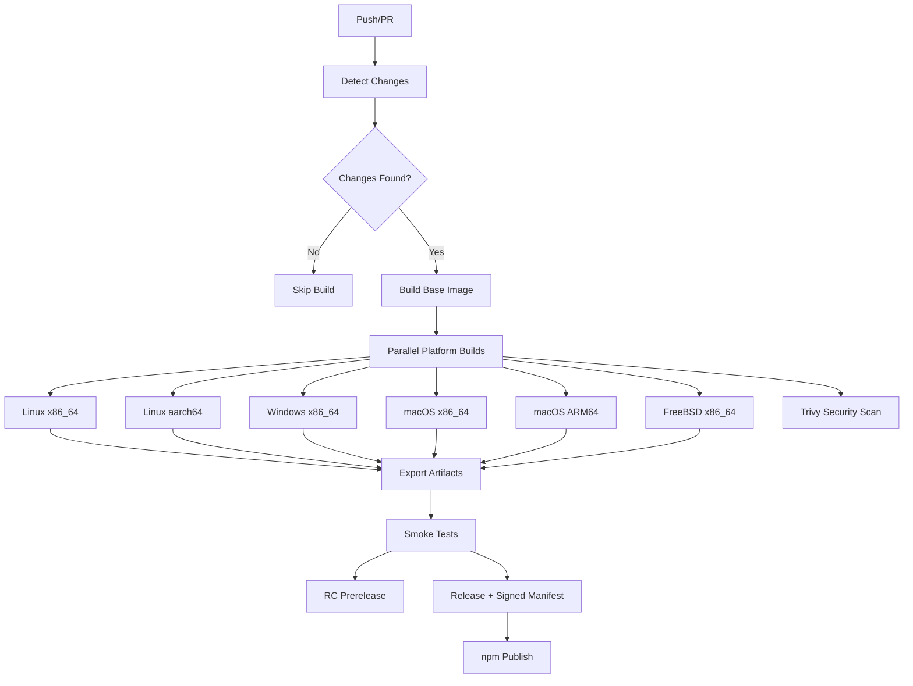

# NoMercy FFmpeg Builder

<div align="center">

[](https://github.com/NoMercy-Entertainment/nomercy-ffmpeg/actions/workflows/main.yml)
[](https://www.npmjs.com/package/@nomercy-entertainment/ffmpeg-static)
[](https://opensource.org/licenses/MIT)

**Internal Build Tool for NoMercy MediaServer**

*High-performance, cross-platform FFmpeg binaries optimized for media processing*

</div>

## 🎯 Purpose

This repository contains the build infrastructure for creating optimized FFmpeg binaries (currently **FFmpeg 8.1.2**) specifically tailored for the **NoMercy MediaServer** ecosystem. These builds include custom filters, muxers, codecs, and optimizations that enhance media processing capabilities within our platform.

> **⚠️ Internal Use Only**
> These FFmpeg builds are specifically configured for NoMercy MediaServer and may not be suitable for general-purpose use. For standard FFmpeg binaries, please visit the [official FFmpeg website](https://ffmpeg.org/).

## 🏗️ Architecture

Our build system uses a modular Docker-based approach: a shared base image ([ffmpeg-base.dockerfile](ffmpeg-base.dockerfile)) provides the toolchains, and per-platform dockerfiles run the numbered build steps in [scripts/](scripts/) — one script per dependency or custom patch — before compiling FFmpeg itself.

### Supported Platforms
| Platform | Architectures | Built in CI |
|----------|--------------|-------------|
| **Linux** | x86_64, aarch64 (ARM64) | ✅ |
| **Windows** | x86_64 | ✅ |
| **macOS** | x86_64, Apple Silicon (ARM64) | ✅ |
| **FreeBSD** | x86_64 | ✅ |
| **Windows** | ARM64 | ⚠️ Dockerfile available, not yet in CI |

Each release ships `ffmpeg`, `ffprobe`, and `ffplay` (where built) as fully static binaries per platform.

### Build Features
- 🔒 **Security Scanning**: Trivy vulnerability assessment on all platform images
- 🧪 **Automated Testing**: Per-platform smoke tests; cross-arch artifacts are validated via ELF header inspection
- 📦 **Artifact Management**: Version-stamped archives with SHA-256 sidecars and a GPG-signed `manifest.json`
- 🔄 **Smart Builds**: Change detection rebuilds only the platforms affected by a commit
- 🚦 **RC Pipeline**: Every master build publishes a Release Candidate prerelease before promotion to a final release

## 🚀 CI/CD Pipeline

Our GitHub Actions workflows provide a complete automation pipeline ([main.yml](.github/workflows/main.yml)):



### Workflow Components
- **Change Detection** ([detect-changes.yml](.github/workflows/detect-changes.yml)): Single source of truth for the platform list; only builds what's changed
- **Reusable Docker Builds** ([reusable-docker-build.yml](.github/workflows/reusable-docker-build.yml)): Parallel compilation on self-hosted runners
- **Smoke Testing**: Binaries are executed on matching GitHub-hosted runners; non-native architectures get archive and ELF-header validation
- **Security Scanning**: Trivy scans with SARIF upload to GitHub code scanning (master builds)
- **Release Management**: RC prereleases on every master build, promoted to versioned final releases with per-asset `.sha256` sidecars, `manifest.json`, and a detached GPG signature (`manifest.json.sig`)
- **PR Guards** ([pr-guards.yml](.github/workflows/pr-guards.yml)): Gate checks on pull requests
- **npm Publish** ([npm-publish.yml](.github/workflows/npm-publish.yml)): Publishes the [`@nomercy-entertainment/ffmpeg-static`](https://www.npmjs.com/package/@nomercy-entertainment/ffmpeg-static) client when a release is created

## 🛠️ Development

### Prerequisites
- Docker with multi-platform support (and Docker Compose)
- GitHub CLI (for release management)
- PowerShell or Bash (depending on platform)

### Local Development
```bash
# Clone the repository
git clone https://github.com/NoMercy-Entertainment/nomercy-ffmpeg.git
cd nomercy-ffmpeg

# Build the shared base image first, then a platform
docker compose build ffmpeg-base
docker compose build ffmpeg-linux-x86_64

# Run a platform build — the packaged archive lands in ./output
docker compose up ffmpeg-linux-x86_64
```

### Testing
```powershell
# Windows
.\tests\tests.ps1
```
```bash
# Linux/macOS
./tests/tests.sh

# Smoke-test a packaged artifact
./tests/smoke.sh
```

See [CONTRIBUTING.md](CONTRIBUTING.md) for contribution guidelines and [UPDATE.md](UPDATE.md) for the dependency update process.

## 📋 Configuration & Features

### ✨ **Enhanced Features vs Official FFmpeg**

Our custom FFmpeg builds include several features **NOT** available in official FFmpeg releases:

#### 🎯 **NoMercy-Exclusive Components** (patched into the FFmpeg source tree)
| Component | Type | What it does |
|-----------|------|--------------|
| **`keydetect`** | Audio filter | Musical key and chord detection |
| **`beatdetect`** | Audio filter | Beat detection via spectral flux analysis |
| **OCR subtitle encoder** | Codec | Converts bitmap subtitles (DVD/Blu-ray) to WebVTT text using Tesseract OCR |
| **Sprite-sheet muxer** | Muxer | Generates thumbnail sprite sheets with a WebVTT timeline for player scrubbing |
| **Chapter VTT muxer** | Muxer | Exports chapter metadata as WebVTT |
| **VOBsub muxer** | Muxer | Writes DVD-style VOBsub subtitle output |
| **OmniDrive protocol** | Protocol | Direct I/O against NoMercy OmniDrive storage (Linux/Windows/FreeBSD) |
| **Auto-create directories** | Core patch | Output muxers automatically create missing parent directories |
| **AACS/BD+ static keydb** | Patch | libaacs/libbluray patched for built-in Blu-ray decryption support |

#### 🤖 **AI & Analysis**
- **OpenAI Whisper Integration**: Built-in speech-to-text via whisper.cpp (`--enable-whisper`)
- **Tesseract OCR**: Text recognition for subtitle extraction (`--enable-libtesseract`)
- **VMAF**: Video quality assessment with built-in models (`--enable-libvmaf`)
- **Chromaprint**: Audio fingerprinting for track identification

#### 🎵 **Audio Excellence**
| Feature | NoMercy Build | Official FFmpeg |
|---------|--------------|-----------------|
| **FDK-AAC** (High-quality AAC) | ✅ Included | ❌ Patent concerns |
| **Twolame MP2** | ✅ Included | ⚠️ Optional |
| **Opus / Vorbis / Theora** | ✅ Included | ⚠️ Optional |
| **CD Audio Extraction** | ✅ libcdio | ❌ Not included |
| **Audio Fingerprinting** | ✅ chromaprint | ⚠️ Optional |
| **Key/Chord & Beat Detection** | ✅ Custom filters | ❌ Not available |

#### 🎬 **Video Codecs & Processing**
| Codec/Feature | NoMercy Build | Official FFmpeg |
|---------------|--------------|-----------------|
| **AV1** | ✅ SVT-AV1 + libaom + rav1e + dav1d | ⚠️ Limited options |
| **HEVC/H.265 & H.264** | ✅ x265 + x264 + hardware accel | ✅ Basic |
| **AVS2** | ✅ libdavs2 + xavs2 | ❌ Not included |
| **VP8/VP9, Xvid, OpenJPEG, WebP** | ✅ Included | ⚠️ Optional |
| **Hardware Acceleration** | ✅ NVENC/NVDEC/CUDA/AMF/QSV (libvpl)/VAAPI | ⚠️ Platform dependent |
| **Vulkan + libplacebo + shaderc** | ✅ Full integration | ⚠️ Optional/experimental |
| **Advanced Scaling** | ✅ libzimg + placebo | ⚠️ Basic only |
| **Frei0r / AviSynth** | ✅ Included | ⚠️ Optional |

#### 📀 **Disc & Container Support**
- **Blu-ray**: libbluray + libaacs with static keydb patches for decryption
- **DVD**: libdvdread + libdvdnav, plus the custom VOBsub muxer
- **CD**: libcdio audio extraction
- **Streaming**: SRT protocol, OpenSSL TLS
- **Subtitles**: libass rendering, libzvbi teletext, OCR-based bitmap-to-text conversion

#### 🔧 **Platform-Specific Optimizations**
| Platform | Hardware Acceleration |
|----------|----------------------|
| **Windows** | DXVA2 + D3D11VA + AMF + NVENC/CUDA + QuickSync |
| **macOS** | VideoToolbox, ad-hoc code-signed binaries (required on Apple Silicon) |
| **Linux** | VAAPI + NVENC/CUDA + AMF + QuickSync (libvpl) |
| **FreeBSD** | Software-optimized static build |

### ⚠️ **Limitations vs Official FFmpeg**

While our builds are feature-rich, some official FFmpeg characteristics differ **intentionally**:

| Aspect | Our Choice | Impact |
|--------|-----------|---------|
| **Shared Libraries** | Static linking only | ⚪ Larger binaries, zero dependency issues |
| **Debug Symbols** | Stripped for production | ⚪ Smaller binary size |
| **Licensing** | GPL + version3 + nonfree | ⚪ Not redistributable as LGPL; internal use |

### 🔧 **Build Configuration Summary**
```bash
# Core Configuration
--enable-gpl --enable-version3 --enable-nonfree
--enable-static --enable-runtime-cpudetect
--enable-filter=all --enable-ffplay

# Audio Codecs
--enable-libfdk-aac      # High-quality AAC (NOT in official builds)
--enable-libmp3lame --enable-libopus --enable-libvorbis
--enable-libtwolame --enable-libtheora

# Video Codecs
--enable-libx264 --enable-libx265
--enable-libvpx --enable-libaom --enable-libsvtav1
--enable-librav1e --enable-libdav1d      # Full AV1 stack
--enable-libdavs2 --enable-libxavs2      # AVS2 (China standard)
--enable-libxvid --enable-libopenjpeg --enable-libwebp

# Hardware Acceleration
--enable-nvenc --enable-cuda --enable-cuda-nvcc --enable-libnpp  # NVIDIA
--enable-amf                     # AMD
--enable-libvpl                  # Intel QuickSync
--enable-vaapi                   # Linux VA-API
--enable-dxva2 --enable-d3d11va  # Windows DirectX
--enable-vulkan --enable-libshaderc --enable-libplacebo
--enable-opencl

# AI & Analysis
--enable-whisper         # Speech recognition (EXCLUSIVE)
--enable-libtesseract    # OCR capabilities (EXCLUSIVE)
--enable-libvmaf         # Video quality assessment
--enable-chromaprint     # Audio fingerprinting

# Disc, Subtitles & Media Support
--enable-libbluray       # Blu-ray with AACS keydb patches (EXCLUSIVE)
--enable-libdvdread --enable-libdvdnav
--enable-libcdio         # CD audio extraction
--enable-libass --enable-libzvbi --enable-librsvg
--enable-libsrt --enable-openssl
--enable-libzimg --enable-frei0r --enable-avisynth
--enable-libomnidrive    # OmniDrive protocol (EXCLUSIVE)
```

## 🔐 Security & Integrity

Security is paramount in our build process:

- **Vulnerability Scanning**: All platform Docker images are scanned with Trivy; results upload to GitHub code scanning
- **Release Integrity**: Every release asset ships a `.sha256` sidecar; `manifest.json` lists all assets with SHA-256 digests and sizes, and `manifest.json.sig` is a detached ASCII-armored GPG signature over the manifest
- **macOS Signing**: Darwin binaries are code-signed with rcodesign (mandatory for ARM64 on macOS 11+)
- **Dependency Management**: Pinned dependency versions with a documented update process ([UPDATE.md](UPDATE.md))

## 📦 Distribution & Integration

### GitHub Releases
Version-stamped archives per platform (`ffmpeg-<version>-<platform>.tar.gz` / `.zip` for Windows), published first as an RC prerelease and then promoted to a final release.

### npm Package
[`@nomercy-entertainment/ffmpeg-static`](clients/npm/README.md) fetches the matching binary for the current platform on first use:

```ts
import { ensureFfmpeg, ensureFfprobe } from '@nomercy-entertainment/ffmpeg-static';

const ffmpeg = await ensureFfmpeg(); // absolute path, downloaded on first call
```

It also installs `nomercy-ffmpeg-path` / `nomercy-ffprobe-path` CLI bins for non-JS tooling.

### NoMercy MediaServer
1. **Automated Updates**: New releases trigger MediaServer updates
2. **Version Pinning**: Specific FFmpeg versions are tested and validated
3. **Manifest Verification**: MediaServer verifies asset digests against the signed `manifest.json`
4. **Configuration Sync**: Build options aligned with MediaServer requirements

## 📄 License

This project is licensed under the MIT License - see the [LICENSE](LICENSE) file for details. Note that the compiled FFmpeg binaries themselves are built with `--enable-gpl --enable-nonfree` and are intended for internal use.

## 🏢 About NoMercy Entertainment

**NoMercy Entertainment** is a cutting-edge media technology company specializing in next-generation streaming solutions and media processing infrastructure.

### Links
- 🌐 **Website**: [nomercy.tv](https://nomercy.tv)
- 📧 **Contact**: support@nomercy.tv
- 💼 **GitHub**: [NoMercy-Entertainment](https://github.com/NoMercy-Entertainment)

---

<div align="center">

**Built with ❤️ by the NoMercy Engineering Team**

*Optimizing media processing, one frame at a time*

</div>
