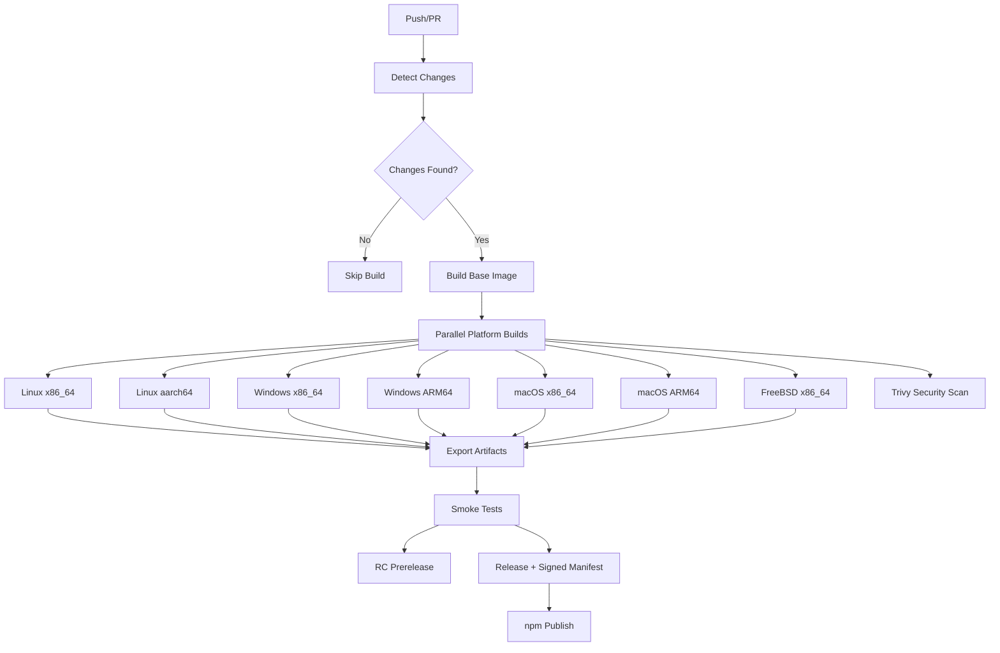

# NoMercy FFmpeg Builder

<div align="center">

[](https://github.com/NoMercy-Entertainment/nomercy-ffmpeg/actions/workflows/main.yml)
[](https://www.npmjs.com/package/@nomercy-entertainment/ffmpeg-static)
[](https://opensource.org/licenses/MIT)

**Internal Build Tool for NoMercy MediaServer**

*High-performance, cross-platform FFmpeg binaries optimized for media processing*

</div>

## 🎯 Purpose

This repository contains the build infrastructure for creating optimized FFmpeg binaries (currently **FFmpeg 9.0**) specifically tailored for the **NoMercy MediaServer** ecosystem. These builds include custom filters, muxers, codecs, and optimizations that enhance media processing capabilities within our platform.

> **⚠️ Internal Use Only**
> These FFmpeg builds are specifically configured for NoMercy MediaServer and may not be suitable for general-purpose use. For standard FFmpeg binaries, please visit the [official FFmpeg website](https://ffmpeg.org/).

## 🏗️ Architecture

Our build system uses a modular Docker-based approach: a shared base image ([ffmpeg-base.dockerfile](ffmpeg-base.dockerfile)) provides the toolchains, and per-platform dockerfiles run the numbered build steps in [scripts/](scripts/) — one script per dependency or custom patch — before compiling FFmpeg itself.

### Supported Platforms
| Platform | Architectures | Built in CI |
|----------|--------------|-------------|
| **Linux** | x86_64, aarch64 (ARM64) | ✅ |
| **Windows** | x86_64 | ✅ |
| **macOS** | x86_64, Apple Silicon (ARM64) | ✅ |
| **FreeBSD** | x86_64 | ✅ |
| **Windows** | ARM64 (aarch64) | ✅ ⚠️ see below |

Each release ships `ffmpeg`, `ffprobe`, and `ffplay` (where built) as fully static binaries per platform.

### Windows on ARM (windows-aarch64)

Built and released like every other platform, with one difference that matters:
**no automated test ever executes it.**

It uses a different toolchain from the rest — llvm-mingw (clang/lld) rather than
GCC, because the GCC cross-compiler for this target crashes on
`-fstack-protector-strong` and ships a CRT header that does not parse.

Nothing in CI can run an ARM64 Windows binary. `windows-latest` is x64, and
Windows-on-ARM emulates x64 rather than the reverse, so `tests/smoke.ps1`
downgrades to validating the PE header (`Machine == 0xAA64`) instead of
executing — the same treatment `smoke.sh` gives `linux-aarch64` and
`freebsd-x86_64`. That proves the artifact is a well-formed ARM64 binary
carrying the expected symbols. It does not prove it decodes a single frame.

There is also no Windows-on-ARM machine in the verify fleet, so `verify-rc.yml`
produces no verdict for it and `sync-checklist.js` leaves its checklist box
unticked. **A release PR therefore stays blocked until a human runs
`tests/tests.ps1` on real hardware and records a verdict.** That is deliberate:
the box is the only thing standing between an unexecuted binary and a release.

When running it by hand, pass the platform explicitly:

```powershell
.\tests\tests.ps1 -Workspace <extracted-dir> -Platform windows-aarch64
```

`-Platform` defaults to `windows-x86_64`, so omitting it produces a verdict
labelled for the wrong platform — which `sync-checklist.js` will then match
against the wrong checklist box.

To close the gap, add a runner labelled
`["self-hosted","ffmpeg-verify","windows-aarch64"]`, then add the matrix entry
in `.github/workflows/verify-rc.yml` and the name in the `REQUIRED` list in
`.github/workflows/fleet-health.yml`. Both carry comments pointing back here.

Meanwhile Windows-on-ARM users are not stranded: the `windows-x86_64` build runs
under Windows' x64 emulation. The native build is a performance improvement.

Capability differences from `windows-x86_64`, all deliberate:

| Component | windows-x86_64 | windows-aarch64 | Why |
|---|---|---|---|
| NVENC / CUDA / AMF / QSV | ✅ | ➖ | No NVIDIA, AMD or Intel GPU exists on Windows-on-ARM |
| OpenBLAS (whisper) | ✅ | ➖ | Builds x86 kernels regardless of `TARGET`; whisper falls back to ggml's own kernels, as on linux/darwin/freebsd |
| SVT-AV1 dotprod/i8mm | n/a | ➖ | Optional aarch64 extension kernels; baseline NEON is on. Enabling them would raise the hardware floor for every WoA device |
| Everything else | ✅ | ✅ | x264, x265, AV1, VPx, opus, xavs2, zimg, Vulkan, and all NoMercy filters/muxers |

### Build Features
- 🔒 **Security Scanning**: Trivy vulnerability assessment on all platform images
- 🧪 **Automated Testing**: Per-platform smoke tests; cross-arch artifacts are validated via ELF header inspection
- 📦 **Artifact Management**: Version-stamped archives with SHA-256 sidecars and a GPG-signed `manifest.json`
- 🔄 **Smart Builds**: Change detection rebuilds only the platforms affected by a commit
- 🚦 **RC Pipeline**: Every master build publishes a Release Candidate prerelease before promotion to a final release

## 🚀 CI/CD Pipeline

Our GitHub Actions workflows provide a complete automation pipeline ([main.yml](.github/workflows/main.yml)):


```mermaid
graph TD
    A[Push/PR] --> B[Detect Changes]
    B --> C{Changes Found?}
    C -->|No| Z[Skip Build]
    C -->|Yes| D[Build Base Image]
    D --> E[Parallel Platform Builds]
    E --> F[Linux x86_64]
    E --> G[Linux aarch64]
    E --> H[Windows x86_64]
    E --> H2[Windows ARM64]
    E --> I[macOS x86_64]
    E --> J[macOS ARM64]
    E --> K[FreeBSD x86_64]
    F --> L[Export Artifacts]
    G --> L
    H --> L
    H2 --> L
    I --> L
    J --> L
    K --> L
    E --> M[Trivy Security Scan]
    L --> N[Smoke Tests]
    N --> O[RC Prerelease]
    N --> P[Release + Signed Manifest]
    P --> Q[npm Publish]
```

### Workflow Components
- **Change Detection** ([detect-changes.yml](.github/workflows/detect-changes.yml)): Single source of truth for the platform list; only builds what's changed
- **Reusable Docker Builds** ([reusable-docker-build.yml](.github/workflows/reusable-docker-build.yml)): Parallel compilation on self-hosted runners
- **Smoke Testing**: Binaries are executed on matching GitHub-hosted runners; non-native architectures get archive and ELF-header validation
- **Security Scanning**: Trivy scans with SARIF upload to GitHub code scanning (master builds)
- **Release Management**: RC prereleases on every master build, promoted to versioned final releases with per-asset `.sha256` sidecars, `manifest.json`, and a detached GPG signature (`manifest.json.sig`)
- **PR Guards** ([pr-guards.yml](.github/workflows/pr-guards.yml)): Gate checks on pull requests
- **npm Publish** ([npm-publish.yml](.github/workflows/npm-publish.yml)): Publishes the [`@nomercy-entertainment/ffmpeg-static`](https://www.npmjs.com/package/@nomercy-entertainment/ffmpeg-static) client when a release is created

## 🛠️ Development

### Prerequisites
- Docker with multi-platform support (and Docker Compose)
- GitHub CLI (for release management)
- PowerShell or Bash (depending on platform)

### Local Development
```bash
# Clone the repository
git clone https://github.com/NoMercy-Entertainment/nomercy-ffmpeg.git
cd nomercy-ffmpeg

# Build the shared base image first, then a platform
docker compose build ffmpeg-base
docker compose build ffmpeg-linux-x86_64

# Run a platform build — the packaged archive lands in ./output
docker compose up ffmpeg-linux-x86_64
```

### Testing
```powershell
# Windows
.\tests\tests.ps1
```
```bash
# Linux/macOS
./tests/tests.sh

# Smoke-test a packaged artifact
./tests/smoke.sh
```

See [CONTRIBUTING.md](CONTRIBUTING.md) for contribution guidelines and [UPDATE.md](UPDATE.md) for the dependency update process.

## 📋 Configuration & Features

### ✨ **Enhanced Features vs Official FFmpeg**

Our custom FFmpeg builds include several features **NOT** available in official FFmpeg releases:

#### 🎯 **NoMercy-Exclusive Components** (patched into the FFmpeg source tree)
| Component | Type | What it does |
|-----------|------|--------------|
| **`keydetect`** | Audio filter | Musical key and chord detection |
| **`beatdetect`** | Audio filter | Tempo, beat grid and confidence as `lavfi.beatdetect.*` frame metadata; octave decided from the onsets, not from a preferred range |
| **`stemsplit`** | Audio filter | Music source separation into vocal and accompaniment stems (Spleeter 2stems on ggml) |
| **OCR subtitle encoder** | Codec | Converts bitmap subtitles (DVD/Blu-ray) to WebVTT text using Tesseract OCR |
| **Sprite-sheet muxer** | Muxer | Generates thumbnail sprite sheets with a WebVTT timeline for player scrubbing |
| **Chapter VTT muxer** | Muxer | Exports chapter metadata as WebVTT |
| **VOBsub muxer** | Muxer | Writes DVD-style VOBsub subtitle output |
| **OmniDrive protocol** | Protocol | Direct I/O against NoMercy OmniDrive storage (Linux/Windows/FreeBSD) |
| **`dvdread:` protocol** | Protocol | `dvdread://` URI input (byte-stream over libdvdread title VOBs, symmetric with `bluray://`) |
| **Auto-create directories** | Core patch | Output muxers automatically create missing parent directories |
| **HEVC alpha layer** | Decoder patch | Decodes the alpha channel of HEVC-with-alpha video from Apple VideoToolbox (single `hvc1` track, two-layer bitstream) instead of silently dropping it. Backports upstream `eedf8f0165fe` + `3befae81f1dc`, neither of which reached 8.1.x, plus a NoMercy change so `ffprobe` reports `yuva420p` at stream level and not just per frame ([ticket #7965](https://trac.ffmpeg.org/ticket/7965)) |
| **`whisper` language detection** | Filter patch | The `whisper` filter exposes the auto-detected spoken language (`lavfi.whisper.language` + `lavfi.whisper.language_confidence` frame metadata, `detected_language` object in JSON output) |
| **AACS/BD+ static keydb** | Patch | libaacs/libbluray patched for built-in Blu-ray decryption support |

#### 🎤 **`stemsplit` — Music Source Separation**

Separates a music track into `vocals` and `accompaniment` stems using the
Deezer Spleeter `2stems` U-Net, run on **ggml** — the same runtime already
statically linked into every platform binary for the `whisper` filter, so
`stemsplit` adds no new dependency and no growth of the shipped tarball.

```bash
# Karaoke: instrumental only, plain -af
ffmpeg -i song.flac -af "stemsplit=model=2stems.gguf:stem=accompaniment" karaoke.flac

# Both stems, one filtergraph with two outputs
ffmpeg -i song.flac -filter_complex \
  "[0:a]stemsplit=model=2stems.gguf:stem=all[v][a]" \
  -map "[v]" vocals.flac -map "[a]" music.flac
```

`stemsplit` emits one 1024-sample frame per STFT hop, so its output is
encoder-friendly everywhere — including formats with a block-size ceiling,
such as FLAC's 65,535 samples. No rechunking filter is needed.

| Option | Type | Default | Description |
|---|---|---|---|
| `model` | string | *required* | Path to the `.gguf` model file |
| `stem` | enum | `all` | `vocals`, `accompaniment`, or `all` (one output pad per stem) |
| `highband` | enum | `extend` | How to handle the band above 11 025 Hz, which the network does not see. `extend` carries each stem's own mask at the top of the modelled band upward, crossfaded in; `passthrough` routes the untouched high band into the last stem; `zeros` reproduces upstream Spleeter bit-for-bit; `average` tiles each frame's mean mask across the band |
| `exponent` | float | `2` | Separation exponent. 2 is the released Spleeter configuration; lower is a softer split, higher a harder one |
| `bleed` | float | `0` | Smallest share of the mixture every stem keeps in any bin. Fills the deepest spectral holes; it is **not** a cure for ducking |
| `smooth` | int | `0` | Smooth the masks over this many frequency bins either side |
| `overlap` | duration | `0` | Crossfade between segments (e.g. `5`, `1.5`, `00:00:05.000`); `0` matches reference Spleeter's un-overlapped chunking |
| `threads` | int | `0` | ggml CPU threads; `0` uses the filter's default |

**Why `extend` is the default.** `passthrough` was, until it was measured. It
loses nothing, but it hands *all* the unmodelled energy to one stem
unconditionally — and just under the edge the vocal network has usually claimed
nearly everything, so the accompaniment's spectrum steps *up* as it crosses
11 025 Hz. On a piano-and-voice ballad that step measures **+14.0 dB**; a bright
band with nothing underneath it, over a body that ducks whenever the singer
sings, is what gets reported as a whistle and a fader. Under `extend` the same
measurement is **−0.4 dB**.

The vocal stem gains more than the accompaniment does: under every other mode
it is hard-cut at 11 kHz, so its sibilance and breath are simply absent.
`extend` puts about **38 dB** of 11–14 kHz and **51 dB** of 14–18 kHz back into
it, while changing nothing inside the modelled band.

**Any rate, any channel count, in and out.** The network is a 44.1 kHz stereo
model, so anything else is converted to that on the way in and back to the
input's own rate and layout on the way out — a 24-bit 96 kHz file produces
24-bit 96 kHz stems. 44.1 kHz two-channel audio takes neither conversion and
runs the path unchanged. Two consequences worth knowing: a hi-res file keeps
its rate but not its top octave, because the separation happened at 44.1 kHz;
and more than two channels is folded to stereo for the network and upmixed
back, which the filter logs as a warning.

**Model:** `spleeter-2stems-f16.gguf` (39,319,552 bytes) is published as a
GitHub release asset on this repository, downloaded the same way whisper's
ggml models are — not bundled in the platform tarballs. *At the time of
writing this asset has not yet been attached to a release; the download
link will resolve once it is published.*

**This is an offline filter, by design.** The network needs a full ~512-frame
(~11.9 s) segment before it can emit anything, so `stemsplit` is unsuitable
for live playback — that lookahead is what the architecture requires, not an
oversight. Throughput on 16 threads of a modern desktop CPU is roughly
**1.8x realtime** for the `2stems` pair (about 0.11x realtime per core,
since ggml's own kernels — not a BLAS gemm — drive the convolutions here):
a four-minute track takes a little over two minutes to separate on such a
machine. Peak resident memory is about **194 MiB** for `stem=all`, rising
somewhat with `overlap` set non-zero. This makes it a good fit for a
media server pre-generating karaoke tracks on library scan, not for
real-time use.

**What's verified and what isn't.** The network's output is checked
layer-by-layer against a Python reference (26 of 26 layers across both
instrument networks, `rtol=1e-3`) — that is what establishes the ggml graph
faithfully reproduces Spleeter's published weights. Separately, summing the
two output stems reconstructs the original mixture to about -138 dB, but
that figure validates only the STFT/overlap-add signal path: the ratio masks
sum to 1 by construction, so the same result holds even if the network's
output were garbage — a deliberate mask-swap mutation still measured
-138.2 dB. **No human has listened to the separated output yet**; treat
separation quality as unverified until that listening pass happens.

**Licensing.** Spleeter's code and released model checkpoints are
MIT-licensed. If you use this filter or its model in published work, please
cite:

> Hennequin, Khlif, Voituret, Moussallam (2020). Spleeter: a fast and
> efficient music source separation tool with pre-trained models. *Journal
> of Open Source Software*, 5(50), 2154,
> [doi:10.21105/joss.02154](https://doi.org/10.21105/joss.02154).

As with any source-separation tool, **you must hold the rights to any
copyrighted material you process** — this carries forward Spleeter's own
upstream advisory.

#### 🤖 **AI & Analysis**
- **OpenAI Whisper Integration**: Built-in speech-to-text via whisper.cpp (`--enable-whisper`)
- **Tesseract OCR**: Text recognition for subtitle extraction (`--enable-libtesseract`)
- **VMAF**: Video quality assessment with built-in models (`--enable-libvmaf`)
- **Chromaprint**: Audio fingerprinting for track identification

#### 🎵 **Audio Excellence**
| Feature | NoMercy Build | Official FFmpeg |
|---------|--------------|-----------------|
| **FDK-AAC** (High-quality AAC) | ✅ Included | ❌ Patent concerns |
| **Twolame MP2** | ✅ Included | ⚠️ Optional |
| **Opus / Vorbis / Theora** | ✅ Included | ⚠️ Optional |
| **CD Audio Extraction** | ✅ libcdio | ❌ Not included |
| **Audio Fingerprinting** | ✅ chromaprint | ⚠️ Optional |
| **Key/Chord & Beat Detection** | ✅ Custom filters | ❌ Not available |

#### 🎬 **Video Codecs & Processing**
| Codec/Feature | NoMercy Build | Official FFmpeg |
|---------------|--------------|-----------------|
| **AV1** | ✅ SVT-AV1 + libaom + rav1e + dav1d | ⚠️ Limited options |
| **HEVC/H.265 & H.264** | ✅ x265 + x264 + hardware accel | ✅ Basic |
| **AVS2** | ✅ libdavs2 + xavs2 | ❌ Not included |
| **VP8/VP9, Xvid, OpenJPEG, WebP** | ✅ Included | ⚠️ Optional |
| **Hardware Acceleration** | ✅ NVENC/NVDEC/CUDA/AMF/QSV (libvpl)/VAAPI | ⚠️ Platform dependent |
| **Vulkan + libplacebo + shaderc** | ✅ Full integration | ⚠️ Optional/experimental |
| **Advanced Scaling** | ✅ libzimg + placebo | ⚠️ Basic only |
| **Frei0r / AviSynth** | ✅ Included | ⚠️ Optional |

#### 📀 **Disc & Container Support**
- **Blu-ray**: libbluray + libaacs with static keydb patches for decryption
- **DVD**: libdvdread + libdvdnav, plus the custom VOBsub muxer and the `dvdread://` input protocol
- **CD**: libcdio audio extraction
- **Streaming**: SRT protocol, OpenSSL TLS
- **Subtitles**: libass rendering, libzvbi teletext, OCR-based bitmap-to-text conversion

#### 🔧 **Platform-Specific Optimizations**
| Platform | Hardware Acceleration |
|----------|----------------------|
| **Windows** | DXVA2 + D3D11VA + AMF + NVENC/CUDA + QuickSync |
| **macOS** | VideoToolbox, ad-hoc code-signed binaries (required on Apple Silicon) |
| **Linux** | VAAPI + NVENC/CUDA + AMF + QuickSync (libvpl) |
| **FreeBSD** | Software-optimized static build |

### ⚠️ **Limitations vs Official FFmpeg**

While our builds are feature-rich, some official FFmpeg characteristics differ **intentionally**:

| Aspect | Our Choice | Impact |
|--------|-----------|---------|
| **Shared Libraries** | Static linking only | ⚪ Larger binaries, zero dependency issues |
| **Debug Symbols** | Stripped for production | ⚪ Smaller binary size |
| **Licensing** | GPL + version3 + nonfree | ⚪ Not redistributable as LGPL; internal use |

### 🔧 **Build Configuration Summary**
```bash
# Core Configuration
--enable-gpl --enable-version3 --enable-nonfree
--enable-static --enable-runtime-cpudetect
--enable-filter=all --enable-ffplay

# Audio Codecs
--enable-libfdk-aac      # High-quality AAC (NOT in official builds)
--enable-libmp3lame --enable-libopus --enable-libvorbis
--enable-libtwolame --enable-libtheora

# Video Codecs
--enable-libx264 --enable-libx265
--enable-libvpx --enable-libaom --enable-libsvtav1
--enable-librav1e --enable-libdav1d      # Full AV1 stack
--enable-libdavs2 --enable-libxavs2      # AVS2 (China standard)
--enable-libxvid --enable-libopenjpeg --enable-libwebp

# Hardware Acceleration
--enable-nvenc --enable-cuda --enable-cuda-nvcc --enable-libnpp  # NVIDIA
--enable-amf                     # AMD
--enable-libvpl                  # Intel QuickSync
--enable-vaapi                   # Linux VA-API
--enable-dxva2 --enable-d3d11va  # Windows DirectX
--enable-vulkan --enable-libshaderc --enable-libplacebo
--enable-opencl

# AI & Analysis
--enable-whisper         # Speech recognition (EXCLUSIVE)
--enable-libtesseract    # OCR capabilities (EXCLUSIVE)
--enable-libvmaf         # Video quality assessment
--enable-chromaprint     # Audio fingerprinting

# Disc, Subtitles & Media Support
--enable-libbluray       # Blu-ray with AACS keydb patches (EXCLUSIVE)
--enable-libdvdread --enable-libdvdnav
--enable-libcdio         # CD audio extraction
--enable-libass --enable-libzvbi --enable-librsvg
--enable-libsrt --enable-openssl
--enable-libzimg --enable-frei0r --enable-avisynth
--enable-libomnidrive    # OmniDrive protocol (EXCLUSIVE)
```

## 🔐 Security & Integrity

Security is paramount in our build process:

- **Vulnerability Scanning**: All platform Docker images are scanned with Trivy; results upload to GitHub code scanning
- **Release Integrity**: Every release asset ships a `.sha256` sidecar; `manifest.json` lists all assets with SHA-256 digests and sizes, and `manifest.json.sig` is a detached ASCII-armored GPG signature over the manifest
- **macOS Signing**: Darwin binaries are code-signed with rcodesign (mandatory for ARM64 on macOS 11+)
- **Dependency Management**: Pinned dependency versions with a documented update process ([UPDATE.md](UPDATE.md))

## 📦 Distribution & Integration

### GitHub Releases
Version-stamped archives per platform (`ffmpeg-<version>-<platform>.tar.gz` / `.zip` for Windows), published first as an RC prerelease and then promoted to a final release.

### npm Package
[`@nomercy-entertainment/ffmpeg-static`](clients/npm/README.md) fetches the matching binary for the current platform on first use:

```ts
import { ensureFfmpeg, ensureFfprobe } from '@nomercy-entertainment/ffmpeg-static';

const ffmpeg = await ensureFfmpeg(); // absolute path, downloaded on first call
```

It also installs `nomercy-ffmpeg-path` / `nomercy-ffprobe-path` CLI bins for non-JS tooling.

### NoMercy MediaServer
1. **Automated Updates**: New releases trigger MediaServer updates
2. **Version Pinning**: Specific FFmpeg versions are tested and validated
3. **Manifest Verification**: MediaServer verifies asset digests against the signed `manifest.json`
4. **Configuration Sync**: Build options aligned with MediaServer requirements

## 📄 License

This project is licensed under the MIT License - see the [LICENSE](LICENSE) file for details. Note that the compiled FFmpeg binaries themselves are built with `--enable-gpl --enable-nonfree` and are intended for internal use.

## 🏢 About NoMercy Entertainment

**NoMercy Entertainment** is a cutting-edge media technology company specializing in next-generation streaming solutions and media processing infrastructure.

### Links
- 🌐 **Website**: [nomercy.tv](https://nomercy.tv)
- 📧 **Contact**: support@nomercy.tv
- 💼 **GitHub**: [NoMercy-Entertainment](https://github.com/NoMercy-Entertainment)

---

<div align="center">

**Built with ❤️ by the NoMercy Engineering Team**

*Optimizing media processing, one frame at a time*

</div>
